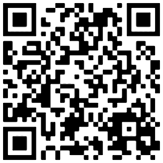

# Food Allergy Card

Website: [allergy.niklasmh.no](https://allergy.niklasmh.no)

Make it easier to show the chefs your allergies. Features:

- 28 predefined allergies (both groups and specifics).
- Images for all the predefined allergies.
- Translated into English, German, Spanish and Norwegian (can show multiple languages at the same time, as well).
- QR code and an URL for sharing your allergies with the chefs. For example this:
  
- Made for being shown from a mobile device.
- Possible to print the card out into physical cards.

## Support this project

If you find this useful and want to give me a thank you, you can buy me a coffee :)

